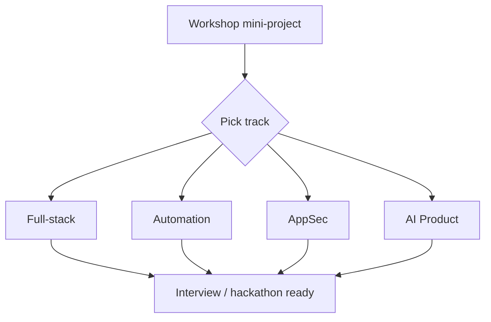

# After the workshop — 4 weeks

**Time:** 3–5 hours/week · **Support:** these docs only — no extra classroom days

Workshop labs stay in [`ai-workshop`](../../ai-workshop/). Keep using this handbook: [START.md](../START.md) · [prompts.md](../prompts.md) · [templates/](../templates/)

**First:** copy [templates/](../templates/) into your project (ARCHITECTURE, LEARNING, `.gitignore`, Cursor rules + skill). Then pick **one** track.

Also do the **[readings and writing](follow-up.md)** every week, regardless of track.

---

## Pick one track

Read each intro (5 min), then commit to one for 4 weeks. You can switch after Week 2 if truly stuck — depth beats hopping.

| Track | You might love it if… | Guide |
|-------|----------------------|-------|
| **Full-stack** | You want API + UI you can demo | [track-fullstack.md](track-fullstack.md) |
| **Automation** | You like Python scripts — files, data, reports | [track-automation.md](track-automation.md) |
| **AppSec** | Secrets, OWASP, hardening the apps you write | [track-security.md](track-security.md) |
| **AI Product** | You want RAG, prompts, small LLM apps (optional) | [track-ai-product.md](track-ai-product.md) · [build-context.md](build-context.md) |

There is **no cloud track**. If you later get personal cloud access, add deploy as a stretch.

OSS list: [oss.md](oss.md)

---

## Universal 4-week structure

| Week | Goal | Proof |
|------|------|-------|
| **1** | Polish Day 2 mini-project | GitHub repo + LEARNING.md started |
| **2** | Track module 1 + 2 | New feature or notes |
| **3** | Small solo project **or** a writing piece | Repo **or** blog/LinkedIn + OSS comment |
| **4** | Hackathon / placement scaffold | README with problem + architecture |

Details: [weekly-challenges.md](weekly-challenges.md) · [follow-up.md](follow-up.md)

---

## Weekly rhythm (suggested)

| Day | Activity (~45–60 min) |
|-----|------------------------|
| Mon | Read (follow-up list or track module) |
| Wed | Build with Cursor/Copilot |
| Fri | Claude review + README / LEARNING.md |
| Sun | OSS browse or writing (30–45 min) |

---

## Tool usage this month

| Phase | Tool |
|-------|------|
| Learn a concept | Claude + **official docs** (verify ChatGPT/Gemini) |
| Implement | Cursor Agent + Copilot |
| Stuck on error | Paste traceback to Claude |
| Before sharing repo | Claude AppSec checklist + your scanner |
| Writing | Claude draft → you edit until it sounds like you |

Which tool when: [START.md](../START.md)

---

## Accountability (peer, not graded)

Find **one buddy** from the workshop. Weekly message:

> "This week I shipped: ___ Wrote: ___ Link: ___"

