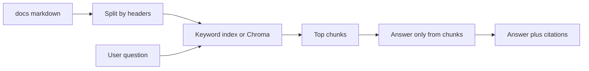

# Build your own context: keyword RAG → vector DB → MCP

After the workshop. Mental model first: [how-editors-work.md](../how-editors-work.md). Track: [track-ai-product.md](track-ai-product.md).

You already used this shape in Cursor (`@` + Rules). Here you **implement** retrieve → stuff into prompt → answer only from that. **Local or free-tier only.** No cloud vector API required.

---

## Ladder

| Stage | Build | When |
|-------|--------|------|
| **0 — Workshop** | Rules + `@` + `ARCHITECTURE.md` | Both days |
| **1 — Keyword RAG** | Split markdown, search, prompt with chunks | Week 2 of AI product track |
| **2 — Vector DB** | Same chunks → embed → Chroma (local) → top-k | Keyword misses paraphrases |
| **3 — Optional MCP** | One tool `search_docs(query)` → chunks | You want Cursor Agent to retrieve |
| **4 — Stop** | No LangChain mega-graph | Depth over stack |

---

## Architecture (copy into `ARCHITECTURE.md`)



| Component | Responsibility | File hint |
|-----------|----------------|-----------|
| Chunker | Split notes; skip `.env` | `chunk.py` |
| Retriever | Keyword **or** vectors | `search.py` |
| Ask | Build prompt; refuse if no hits | `rag_query.py` |
| Optional MCP | Expose `search_docs` | `mcp_notes.py` |

**Trade-off:** keyword first (stdlib, debuggable). Vectors when “same meaning, different words” fails. MCP when the *editor* should call search — not required for a CLI demo.

---

## Stage 1 — Keyword RAG (do this first)

**Learn:** split `docs/` by `##` headers; search; paste top chunks into Claude/ChatGPT or a local model: *answer only from these chunks; if missing, say I don’t know*.

**Build:** `rag_query.py`. Print **file + heading** as citations. Never index `.env`, `.venv`, or secrets.

This **is** Module 1 of [track-ai-product.md](track-ai-product.md).

---

## Stage 2 — Vector DB (graduate when keyword fails)

**When:** many notes, paraphrases, or grep feels useless.

**Build (local):** chunk as in Stage 1 → embeddings (Ollama or a small local embed model) → [Chroma](https://github.com/chroma-core/chroma) → top-k (start with k=4) → **same** “answer only from chunks” prompt.

Keep k small so you don’t blow the context window. Still cite `path` + heading.

Read the Chroma README; don’t wrap five frameworks around it.

---

## Stage 3 — Optional MCP (same retrieval, Agent-shaped)

**When:** you want Cursor to call `search_docs` instead of you running the CLI.

Sketch (after workshop — you write it; keep it tiny):

```text
Tool: search_docs
Args: query: string
Returns: list of { path, heading, text }  # truncated
```

Wire one server you understand. **Off by default** in other projects. Tokens and `.env` stay out of the server. Safety: [marketplace.md](../marketplace.md).

MCP is **not** extra memory. Tool output is **more text in the pack**.

---

## Safety

- Do not embed or index secrets, college credentials, or other people’s private data
- Cap chunk size and `k` so the window stays readable
- Human approval for Agent/MCP shell
- If retrieval is empty: **I don’t know** — don’t invent syllabus facts

---

## Design prompt (Claude — no code yet)

```
Design a notes Q&A for a 4th-year CSE student.
Stage 1: keyword RAG over docs/*.md.
Stage 2: same chunks in local Chroma.
Stage 3: optional MCP tool search_docs.

Output: Mermaid, file table, when to graduate keyword → vectors,
what to do if no chunks hit. No implementation code. Local only.
```

Then implement **one stage** in Cursor. OSS: [ollama](https://github.com/ollama/ollama) · [chroma](https://github.com/chroma-core/chroma) · [oss.md](oss.md).
