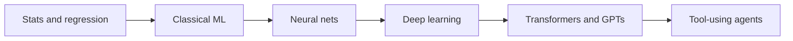
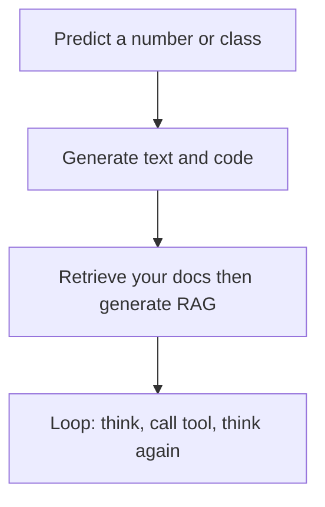

# AI / ML history — quick refresh

From **fitting a line** to **models that call tools**. No exam math. Names you can say in an interview, and **what people actually used each era for**.

Day 1 landscape stays short: [01-ai-landscape.md](../ai-workshop/day1/01-ai-landscape.md). How editors pack context: [how-editors-work.md](how-editors-work.md). Build RAG/MCP later: [after/build-context.md](after/build-context.md).

**Through-line:** more data + more compute + better *representation of language and images* → systems that **predict**, then **generate**, then **act in a loop**.

---

## Eras (what changed)

| Era | Roughly | Idea in one line | Typical use |
|-----|---------|------------------|-------------|
| **Statistics** | 1800s–1950s | Fit a formula to numbers | Averages, census, early “least squares” |
| **Symbolic AI** | 1950s–80s | Hand-written rules and search | Chess, expert systems, “if–then” |
| **Classical ML** | 1990s–2010s | Learn weights from **labeled tables** | Spam, credit risk, recommend “users like you” |
| **Deep learning** | ~2012–2017 | Many-layer nets on **pixels and audio** | ImageNet, speech, translation (still special-purpose) |
| **Transformers / GPT** | 2017–2022 | One architecture, **next-token** prediction at scale | Chat, code complete, summarize |
| **Product + agents** | 2022–now | Chat UI, then **tools, files, loops** | Copilot, Cursor Agent, RAG, MCP |

Winters (funding dried up) happened when **hype > data/compute**. Deep learning stuck because GPUs + ImageNet-scale data finally matched the idea.

---

## 1 — Statistics and regression (still the foundation)

**Linear regression:** draw the best line through points. **Logistic regression:** same idea for yes/no (spam or not).

You already use this mindset: *input features → a number or a class*. Classical ML (decision trees, SVM, random forests) is “better features / better splits,” still usually a **spreadsheet-shaped** problem.

**Use case:** predict house price, pass/fail, next-week demand. Not “write my FastAPI app.”

---

## 2 — Symbolic AI (rules, not learning)

1956 “Dartmouth workshop” named **Artificial Intelligence**. Early programs: search, logic, expert systems (doctors’ checklists as `if` rules).

**Use case:** chess, configuration, “the company policy is…” **Broke** when the world had too many exceptions. Learning from data took over for perception and language.

You still write **rules** today — `.cursor/rules` is that idea, for an LLM, not a 1980s expert system.

---

## 3 — Neural networks (the comeback)

A **neuron** = weighted sum + nonlinearity. Stack them = **neural net**. **Backprop** (1980s, widely used later) = how weights get updated from error.

**Perceptron** (1958) was a single layer — cannot learn XOR-style patterns. Multi-layer nets can. They stayed niche until data and GPUs.

**Use case (then):** small digit recognition, toy demos. Not ChatGPT.

---

## 4 — Deep learning (vision and speech first)

**2012 AlexNet** on ImageNet: deep conv nets crush hand-crafted vision features. Then speech (DeepSpeech-style), then translation.

**CNN** = spatial patterns (images). **RNN / LSTM** = sequences (text, time) — slow to train, forget long context.

**Use case:** tag photos, transcribe audio, translate *this sentence*. One model, **one job**. You still train (or fine-tune) on **your** labeled set.

---

## 5 — Transformers and GPTs (language becomes general)

**2017 — “Attention Is All You Need”:** **transformer** — attend to all tokens in parallel. Scales on GPUs.

**GPT** = Generative Pre-trained Transformer: train to predict the **next token** on a huge text crawl, then (optionally) **instruction-tune** so it follows prompts.

| Step | What it is |
|------|------------|
| **Pre-train** | Next-token on the internet / books / code |
| **Fine-tune / RLHF** | Prefer helpful, harmless, instruction-following answers |
| **Prompt** | Your task at *inference* — no new training in this workshop |

**GPT-2 / GPT-3** showed “more scale → more general.” **ChatGPT (Nov 2022)** put a **chat UI** on that. **Copilot** put it **in the editor** (code as the domain). **Claude, Gemini, Cursor** = same family of idea: long context, tools, multi-file.

**Use case shift:** not “classify this row” but **generate** text/code that *looks* right. That is why you **run tests** and **read diffs**.

---

## 6 — Use cases evolved (the point of this page)

| Then | Now (what you do in this workshop) |
|------|-------------------------------------|
| Fit `y = wx + b` on CSV | Chat: explain CORS, then **verify docs** |
| Train a spam classifier | Copilot Tab: next 5 lines in a file you own |
| One CNN for cats vs dogs | Cursor Agent: edit **several files**, run terminal |
| Expert-system rules | **Rules + Skills** + you Approve |
| “The model is the product” | **Pack context** (`@`, RAG, MCP) + **you** ship |

**Agent** = LLM + **tools** + a loop (search, run tests, edit). Not a new species of magic — the 2025+ developer story in [01-ai-landscape.md](../ai-workshop/day1/01-ai-landscape.md).

---

## Recent advancements (what “new” means in 2024–26)

Skim; don’t memorize product names.

| Advance | Why it matters to you |
|---------|------------------------|
| **Large context windows** | Paste an architecture file; still not “the whole company” |
| **Multimodal** | Image/UI screenshots as input (optional; not a lab) |
| **RAG** | Ground answers in *your* notes — [build-context.md](after/build-context.md) |
| **Tool use / MCP** | Model calls GitHub, search, *your* `search_docs` |
| **Reasoning-style models** | More tokens “thinking”; still hallucinate; still verify |
| **Local models (Ollama)** | No cloud key; weaker than frontier chat; good for private notes |
| **Code agents** | Multi-file edits — **you** review, or Git revert |

Not required this week: training your own GPT, CUDA kernels, “AGI” debates.

---

## Map to CSE subjects you already have

| You studied | AI/ML name |
|-------------|------------|
| Line of best fit, probability | Regression, likelihood |
| Matrices, gradients (calc) | How nets update (backprop) |
| Graphs / search | Old symbolic AI, also agent “which tool?” |
| HTTP APIs | How Copilot/Cursor **call** a hosted model |
| OS + processes | Agent running **your** terminal |

The jump is **scale + language as the interface**, not “statistics was fake.”

---

## Interview lines

> “Classical ML predicts from tables. Deep learning learned pixels and speech. Transformers learned to predict the next token at scale — that’s GPT. Products added chat, then editor context, then tools. I use agents to draft; I still design, run, and own the diff.”

> “An agent is a loop over tools, not a database of truth.”

---

## Optional 20-minute read (after Day 1)

- [Hugging Face LLM course — chapter 1](https://huggingface.co/learn/llm-course/chapter1/1) (Week 0 in [follow-up.md](after/follow-up.md))
- How the **pack** works in Cursor: [how-editors-work.md](how-editors-work.md)
