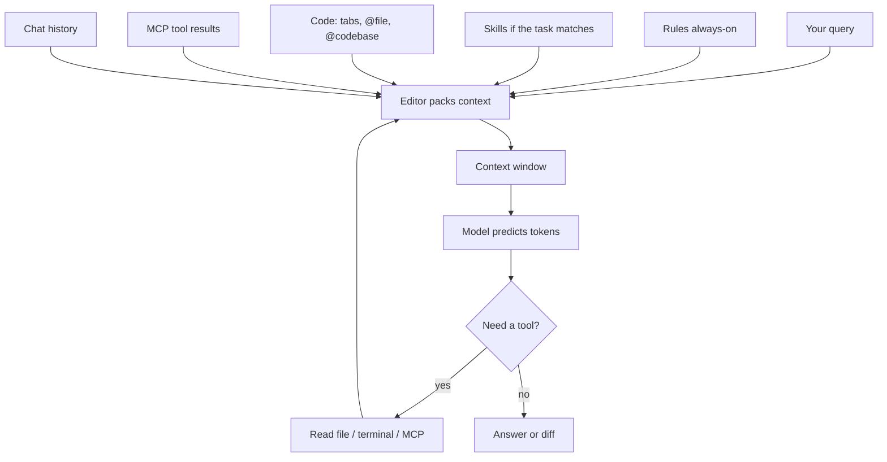

# How AI code editors actually work

The model does **not** see your whole repo, your laptop, or “the project.” It sees a **packed prompt** that must fit a **context window**. Cursor, Copilot, and similar tools are **packers + tool loops**. You steer the pack.

Skim on Day 1 (landscape). Build your own pack later: [after/build-context.md](after/build-context.md). Safety: [marketplace.md](marketplace.md).

---

## Chat vs editor

| | ChatGPT / Claude.ai | Cursor / Copilot in the IDE |
|--|---------------------|-----------------------------|
| What the model sees | What you **paste** | What the **editor packs** (files, rules, search, tools) |
| Your repo | Invisible unless pasted | Still not fully visible — only retrieved slices |
| Training data | Patterns from the internet | Same — **not** a copy of your disk |

Hallucinations happen when the pack is empty, noisy, or wrong. `@` and Rules are how you fix that.

---

## Anatomy of one Agent turn

| Layer | Who puts it in | Your lever |
|-------|----------------|------------|
| Product / system instructions | The editor | You don’t edit this |
| **Rules** | `.cursor/rules` | Always-on conventions |
| **Skills** | `SKILL.md` if the job matches | Playbook for a *kind* of task |
| **Code** | Open tabs, `@file`, `@folder`, `@codebase` | Be explicit |
| **MCP results** | Tool call → text back into the prompt | Extra sources |
| **History** | Earlier messages in this chat | New chat if the thread is junk |
| **Your query** | You | Task + constraints + output shape |

Copilot Tab is a smaller pack: mostly **the current file** (and sometimes nearby tabs). That is why comments-as-prompts work and why Tab is weak at architecture.

---

## Context window (why `@` matters)

The window is a **token budget** (chunks of text). If the pack is too big, older or “less relevant” pieces get **truncated**. If the pack is too vague (`@codebase` for one endpoint), the model drowns in noise.

| You want | Pack this |
|----------|-----------|
| One endpoint | `@ARCHITECTURE.md` + `@main.py` |
| “What does this repo do?” | `@README.md` + `@codebase` (read only) |
| Match team style | A **short** Rule, not a novel |

Same idea as [prompting.md](prompting.md): role + context + task + constraints. The editor just **fills context for you** when you `@`.

---

## Tab vs Chat vs Agent

| Mode | Pack | Loop |
|------|------|------|
| **Tab** | Local file | One next-line guess |
| **Chat** | What you `@` + the question | Answer or small edit |
| **Agent** | Same pack, then **tools** | Think → read/edit/terminal → think again |

You still **Approve** diffs and shell commands. The loop is not a guarantee of correctness.

---

## Retrieval is already in the editor

`@codebase` ≈ **search your repo, then paste hits into the prompt**. That shape **is RAG**: retrieve, then generate.

A **vector DB** is another search engine — useful for *your notes/PDFs* when grep/`@` is not enough. [MCP](marketplace.md) is another way to retrieve: the model **calls a tool**, and the **result text** joins the pack.

None of these is extra memory inside the model. They are **more text in the same window**.

---

## MCP in one screen

**MCP** = a standard so the agent can use **tools** (GitHub, browser, a database, later *your* `search_docs`).

1. Server advertises tools (name, args).
2. Model picks one and fills JSON args.
3. Server runs; returns text (or an error).
4. That text is **packed** for the next think step.

It is not a second brain. Treat a random MCP like untrusted code — [marketplace.md](marketplace.md).

---

## Vector DB in one screen

| Term | Student meaning |
|------|-----------------|
| **Embedding** | Turn a text chunk into a list of numbers (“meaning-ish”) |
| **Vector DB** | Store those lists; on query, return **nearest chunks** (e.g. Chroma, local) |
| **RAG** | Put those chunks in the prompt: *answer only from this* |

If retrieval misses, the honest app says **“I don’t know.”** Do not fine-tune a model for a college notes bot.

---

## What this is not

- Not the IDE “memorizing” your project forever
- Not training or fine-tuning
- Not automatic correctness — run the code

**Interview line:** *“The editor packs rules, the files I @, and tool results into a context window. I control that pack; I don’t assume the model can see the whole repo.”*

Implement the same pack yourself: [after/build-context.md](after/build-context.md). Cursor how-to: [tools/cursor.md](tools/cursor.md).
