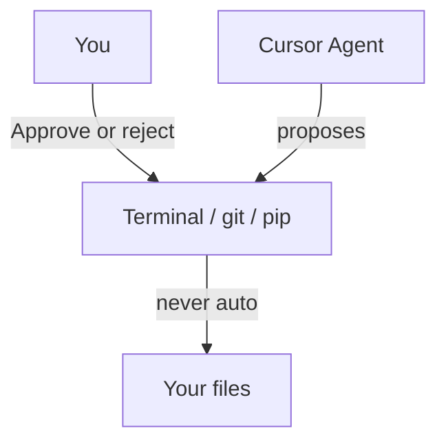

# What not to do with AI

**Strict** rules first, then habits that waste time or get you in trouble. This workshop *wants* AI. College assignments, internships, and GitHub may not.

Day 1 say-aloud: [01-ai-landscape.md](../ai-workshop/day1/01-ai-landscape.md). Day 2 lab: [AppSec](../ai-workshop/day2/03-appsec-lab.md). Marketplace/MCP: [marketplace.md](marketplace.md). Prompt anti-patterns: [prompting.md](prompting.md).

Treat every chat (ChatGPT, Claude, Gemini, Cursor, Copilot) as **someone else’s computer** that may **log, train on, or leak** what you paste.

---

## Never (strict)

| Don't | Why | Do instead |
|-------|-----|------------|
| Paste **long-lived secrets** | Chats are stored; leaks are forever until you **rotate** | Names only: `API_KEY` in `.env`. Values stay on your machine |
| Paste `.env`, `credentials.json`, PEM/SSH keys, JWT **tokens**, DB URLs with passwords | Same | `.env.example` with placeholders |
| Paste **college passwords**, LMS, Wi-Fi, email, banking | Account takeover | Never |
| Paste **other people’s** data (classmates’ marks, Aadhaar, phone lists) | Privacy + policy | Synthetic / dummy rows |
| Commit secrets, then “fix” by a later commit | GitHub history still has them | `.gitignore` first; if leaked: **rotate**, don’t just delete the line |
| Tell Agent to **auto-run** shell / unknown MCP | `rm`, `git push --force`, exfil | You Approve each command |
| Install a random Marketplace skill/MCP and give it **tokens** | Untrusted code with your repo | Read `SKILL.md`; one official server; disable unused |
| Open **mass AI PRs** on OSS | Maintainers ban the username | Docs/tests, small, **you** wrote the PR text |
| Use AI on **graded work** if faculty forbids it | Academic honesty | Ask. Workshop ≠ assignments |
| Ship code you **cannot explain** | Interviews and bugs | Read the diff; run it; delete what you don’t own |

**Long-lived key** = anything that still works next month without you sitting there: API keys, cloud access keys, GitHub PATs, SMTP passwords, private keys. **Short demo tokens** in a leaky *workshop dummy folder* are fake on purpose — never swap in a real one.

If it might have leaked: **rotate** (revoke + new secret). Editing the chat later does not un-send it.

---

## Strongly not recommended

| Don't | What goes wrong | Do instead |
|-------|-----------------|------------|
| `@codebase` + “rewrite everything” | Hidden breakage | One feature, named files |
| Accept a **500-line** Agent diff unread | Bugs + extra deps | File-by-file; `pytest` / `/docs` after each Accept |
| “Make it production ready” / “add auth + Docker + K8s” | Scope explosion | 5-item checklist for *today* |
| Trust ChatGPT/Gemini **facts** (status codes, package names) | Hallucinated libraries | Official docs; tick or reject one claim |
| Let Copilot invent **PyPI** packages or crypto | Supply-chain / broken crypto | stdlib + fastapi unless you asked |
| Paste a **full production dump** “to debug” | Data leak | Minimal traceback + 10 lines |
| Index `.env` into RAG / vector DB | Secrets in embeddings | [build-context.md](after/build-context.md) skip list |
| `file://` HTML talking to an API, or CORS `*` “for real users” | Confusing bugs / open APIs | Serve UI from FastAPI in this workshop |
| Disable `.gitignore` “just this once” | The one-time becomes GitHub | Keep `.env` ignored |

---

## Agent, Git, and your laptop

**Reject** if you don’t understand it: `rm -rf`, `sudo`, `curl | sh`, `git reset --hard`, `git push --force`, `chmod 777`, pip installing a name you didn’t ask for.

**Do:** small commits; revert a bad Agent run with Git instead of arguing in chat.

---

## Privacy and college

- **Workshop:** AI is expected. **Coursework / exams:** ask faculty.
- Don’t upload **question papers**, unpublished assignments, or a company’s intern repo to a public model.
- Don’t put real **patient / bank / company** data in a student RAG demo.
- Screenshots of Slack/email in chat: same as pasting the text.

---

## What *is* OK to paste

| OK | Not OK |
|----|--------|
| Traceback with **paths you wrote** | Traceback that includes a connection string |
| `main.py` **without** secrets | `main.py` with `sk-live-...` in a string |
| Dummy `API_KEY=your_key_here` | A real key “just for five minutes” |
| Architecture table, API contract | Classmate’s entire project zip “to compare” |

---

## Effective use (the other half)

1. **Design first** — skip `ARCHITECTURE.md` and you will generate the wrong app faster.
2. **Narrow prompts** — one endpoint, one bug, one file.
3. **Verify** — run code; open docs; you pick trade-offs.
4. **Own the pack** — `@ARCHITECTURE.md` beats dumping the repo. [how-editors-work.md](how-editors-work.md)
5. **Interview line:** *“I used AI to draft; I never pasted secrets; I can explain every line that shipped.”*

---

## 30-second checklist (before Send / Accept)

- [ ] No passwords, tokens, `.env`, or college login
- [ ] No other people’s private data
- [ ] Prompt names **one** change
- [ ] I will **read** the diff and **run** the result
- [ ] Agent command: I understand it or I click **Reject**

Full “how to prompt”: [prompting.md](prompting.md) · START rules: [START.md](START.md)
